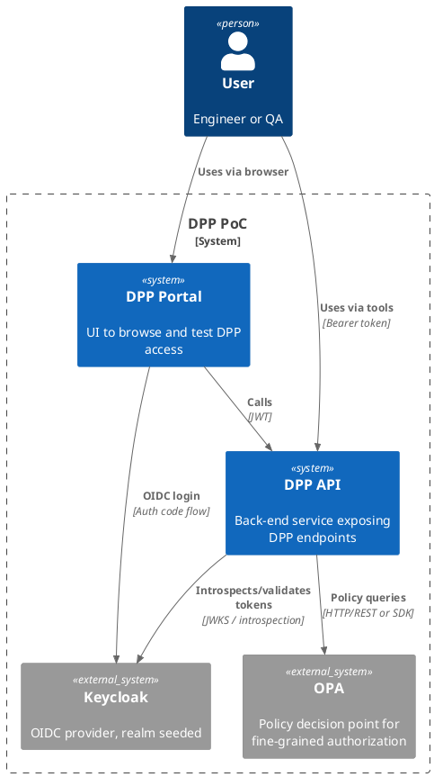
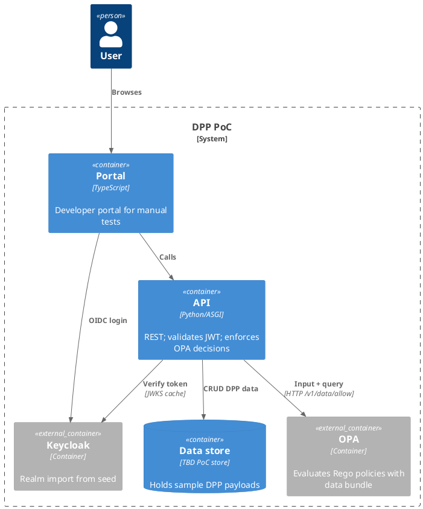
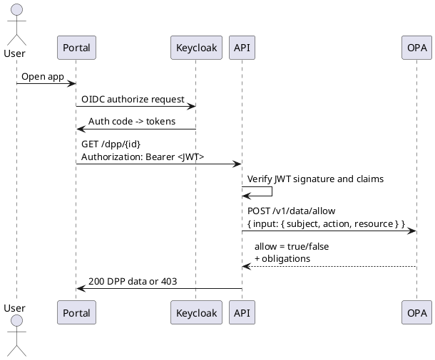
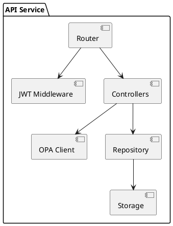

# DPP PoC — Digital Product Passport, policy-guarded API and portal

> **Purpose**
> This proof-of-concept shows a minimal Digital Product Passport stack with a policy-guarded backend API, a simple portal, and developer-friendly local orchestration.

## Table of contents

- [DPP PoC — Digital Product Passport, policy-guarded API and portal](#dpp-poc--digital-product-passport-policy-guarded-api-and-portal)
  - [Table of contents](#table-of-contents)
  - [What’s in this repo](#whats-in-this-repo)
  - [Solution overview](#solution-overview)
  - [Architecture](#architecture)
    - [C4 Context](#c4-context)
    - [C4 Container](#c4-container)
    - [Request flow](#request-flow)
    - [API component sketch](#api-component-sketch)
  - [Local development](#local-development)
    - [Prerequisites](#prerequisites)
    - [Secrets setup](#secrets-setup)
    - [First run](#first-run)
    - [Useful commands](#useful-commands)
  - [Configuration](#configuration)
    - [Environment](#environment)
    - [Docker Compose services](#docker-compose-services)
  - [Security and policy](#security-and-policy)
    - [Authentication](#authentication)
    - [Authorization with OPA](#authorization-with-opa)
    - [Policy bundle layout](#policy-bundle-layout)
  - [Data model](#data-model)
  - [Portal](#portal)
  - [Testing and QA](#testing-and-qa)
  - [Operations](#operations)
  - [Conventions](#conventions)
  - [Roadmap](#roadmap)
  - [References](#references)
    - [Maintainers](#maintainers)
    - [License](#license)

---

## What’s in this repo

The top level contains these directories and files:

* `api/` — backend service source
* `portal/` — frontend portal
* `opa/` — policy engine artifacts and config
* `seed/` — initial identity and sample data seeding, for example a Keycloak realm export
* `compose.yaml` — local orchestration
* `C4 - Container.wsd` — PlantUML architecture sketch
* `bundle.rego` — example Rego policy entry point
* `data.json` — example policy data bundle content
* `setup-secrets.ps1` and `verify-secrets.ps1` — helper scripts to provision local secret files
* `.gitignore`, `dpp.code-workspace` — repo hygiene and VS Code workspace

*Source: repo file list and language mix visible on GitHub.* ([GitHub][1])

---

## Solution overview

* **Goal** — expose minimal DPP read APIs behind authentication and policy decisions, plus a simple portal to test end-to-end.
* **AuthN** — Keycloak for OAuth2/OIDC and realm seeding.
* **AuthZ** — OPA for policy decisions using Rego, fed by a lightweight data bundle.
* **Run-local** — Docker Compose brings up Keycloak, OPA, API, and the portal with seeded data.

---

## Architecture

### C4 Context



### C4 Container



### Request flow



### API component sketch



---

## Local development

### Prerequisites

* Docker Desktop or compatible engine
* Make or PowerShell for convenience
* PlantUML preview plugin if you want to render the diagrams locally
* Modern Node.js if you intend to hack on `portal/` directly
* Python toolchain if you intend to hack on `api/`

### Secrets setup

Run the helper script to create per-service secret files used by `compose.yaml`:

```powershell
# Windows PowerShell
.\setup-secrets.ps1
.\verify-secrets.ps1
```

> These scripts create the files expected by services at runtime, for example admin credentials for Keycloak or DB user/password files referenced from `compose.yaml`. Validate with `verify-secrets.ps1`.

### First run

```bash
# in repo root
docker compose pull
docker compose up -d

# watch logs if needed
docker compose logs -f --tail=200
```

When Keycloak starts with a realm JSON in a mounted path, the server can import it on boot. The documented approach is realm import using JSON files. ([Keycloak][2])

### Useful commands

```bash
# stop everything
docker compose down

# stop and remove volumes if you want a clean slate
docker compose down -v

# restart only API after code change
docker compose up -d --build api

# open OPA decision log (if enabled)
docker compose logs -f opa
```

---

## Configuration

### Environment

Create a `.env` in repo root if you want to override defaults referenced by `compose.yaml`, for example:

```dotenv
# example keys - adjust to match compose services
KEYCLOAK_ADMIN_USER=admin
KEYCLOAK_ADMIN_PASSWORD=change_me
OIDC_REALM=dpp
OIDC_CLIENT_ID=dpp-portal
OIDC_ISSUER=http://localhost:8080/realms/dpp
API_PORT=8088
PORTAL_PORT=8089
OPA_URL=http://opa:8181
```

> Match keys to the environment section of each service in `compose.yaml`.

### Docker Compose services

`compose.yaml` orchestrates at least these services:

* **keycloak** — runs the server, imports the realm JSON at startup
* **opa** — Open Policy Agent with a bundle or local policy files mounted
* **api** — backend service
* **portal** — developer UI

Use `docker compose config` to view the resolved environment and ports. If you want to use realm import on startup, Keycloak supports JSON import workflows. ([Keycloak][2])

---

## Security and policy

### Authentication

* OIDC through Keycloak. The portal uses the standard Authorization Code Flow. Tokens are then presented to the API as Bearer JWTs.
* The API should validate the JWT signature using the realm’s JWKS and verify basic claims such as issuer, audience, expiry.

### Authorization with OPA

* The API constructs an **input** document `{ subject, action, resource, context }` and queries OPA for a decision.
* Rego policy evaluates the request against attributes and data loaded from bundles.

> OPA bundles are the recommended way to get policies and data into OPA. ([Open Policy Agent][3])

**Minimal Rego example** aligned with a PoC:

```rego
# bundle.rego
package dpp.authz

default allow = false

allow {
  input.action == "read"
  some role
  role := input.subject.roles[_]
  role == "dpp:reader"
}

# optional obligations example
obligations := {"mask_fields": ["internalNotes"]}
```

**Query from API**:

```http
POST /v1/data/dpp/authz/allow
Content-Type: application/json

{
  "input": {
    "subject": { "sub": "user-123", "roles": ["dpp:reader"] },
    "action": "read",
    "resource": { "type": "dpp", "id": "uuid-abc" },
    "context": { "ip": "127.0.0.1" }
  }
}
```

### Policy bundle layout

> If you package policies as a bundle, structure them as a gzipped tarball with `policy.rego` and optional `data.json`. OPA prevents runtime edits to bundle-loaded policy through the REST API. ([Open Policy Agent][3], [Stack Overflow][4])

```
bundle.tar.gz
└─ .manifest        # optional metadata
└─ policies/
   └─ bundle.rego
└─ data/
   └─ data.json
```

Mount a local folder while developing, or point OPA at an HTTP server that serves the bundle.

---

## Data model

DPP payloads in a PoC can be minimal JSON records keyed by a unique product instance or batch.

Example:

```json
{
  "id": "urn:example:product:12345",
  "schema": "prototype-v1",
  "attributes": {
    "model": "X-Tool 4000",
    "batch": "2025-08",
    "material": ["steel", "polymer"],
    "docs": ["https://example.com/manual.pdf"]
  },
  "provenance": {
    "operator": "LEI:529900T8BM49AURSDO55",
    "facility": "GLN:5790001330551"
  }
}
```

Attach policy-relevant attributes such as classification level or data owner so Rego can filter fields for readers.

---

## Portal

* Purpose: a thin UI to log in, call API endpoints, and visualize responses.
* Typical pages: Login, DPP search, DPP detail, Policy debug.
* Secure the SPA by reading configuration from environment at build time. Use PKCE with Authorization Code Flow.

---

## Testing and QA

* **Unit tests**: add lightweight tests for your Rego policies using `opa test`.
* **Contract tests**: define API response contracts that include masking rules enforced by obligations from OPA.
* **Smoke tests**: a Postman or `pytest` suite that logs in via Keycloak and exercises a read flow.

Example Rego test:

```rego
package dpp.authz

test_reader_can_read {
  data.dpp.authz.allow with input as {"subject": {"roles": ["dpp:reader"]}, "action": "read", "resource": {}}
}
```

---

## Operations

* **Logs**: tail `api`, `opa`, and `keycloak` logs via Compose.
* **Policy reload**: when using bundles sourced from an HTTP server, OPA refreshes them on interval. For local dev, rebuild and restart the `opa` container.
* **Keycloak realm**: realm imports work at startup. For repeatable imports in Kubernetes, you can also use the Keycloak Operator’s realm import CRD if you take this beyond local. ([Keycloak][5])

---

## Conventions

* **Languages**: Python for API, TypeScript for portal, Rego for policy, PowerShell for secret scaffolding. Confirmed by language breakdown on GitHub. ([GitHub][1])
* **Diagrams**: Use C4-PlantUML macros from the PlantUML stdlib for consistency. ([GitHub][6], [crashedmind.github.io][7], [PlantUML.com][8])
* **ID schemes**: Prefer resolvable URNs or URLs for DPP IDs in the PoC.

---

## Roadmap

1. Replace in-memory or file store with a simple Postgres instance.
2. Add field-level filtering in the API based on OPA obligations.
3. Expand the portal with DPP create and update flows guarded by policy.
4. Add CI that lints Rego, runs `opa test`, and exercises a smoke test against `docker compose up`.
5. Harden Keycloak configuration with real TLS and distinct clients for API and portal.

---

## References

* **This repo**: file inventory and language mix used to derive structure. ([GitHub][1])
* **OPA bundles**: what they are, how to serve them. ([Open Policy Agent][3], [D Boles OPA Docs][9])
* **OPA overview**: policy as code and decision APIs. ([Open Policy Agent][10])
* **Keycloak realm import and config**: import JSON and server startup configuration. ([Keycloak][2])
* **C4-PlantUML**: library and stdlib availability. ([GitHub][6], [crashedmind.github.io][7])
* **PlantUML language guide**: syntax reference for UML diagrams. ([pdf.plantuml.net][11])

---

### Maintainers

* @mfhens

---

### License

PoC status. Add a license file before sharing builds outside your org.

[1]: https://github.com/mfhens/dpp/ "GitHub - mfhens/dpp: DPP PoC"
[2]: https://www.keycloak.org/server/importExport?utm_source=chatgpt.com "Importing and exporting realms"
[3]: https://openpolicyagent.org/docs/management-bundles?utm_source=chatgpt.com "Bundles"
[4]: https://stackoverflow.com/questions/65778190/open-policy-agent-how-to-persist-policies-from-rest-api?utm_source=chatgpt.com "open policy agent - How to persist policies from REST API?"
[5]: https://www.keycloak.org/operator/realm-import?utm_source=chatgpt.com "Automating a realm import"
[6]: https://github.com/plantuml-stdlib/C4-PlantUML?utm_source=chatgpt.com "C4-PlantUML combines the benefits ..."
[7]: https://crashedmind.github.io/docdac-site/plantuml_c4.html?utm_source=chatgpt.com "PlantUML C4 — DOCDAC documentation"
[8]: https://plantuml.com/stdlib?utm_source=chatgpt.com "PlantUML Standard Library"
[9]: https://dboles-opa-docs.netlify.app/docs/v0.10.7/bundles/?utm_source=chatgpt.com "Open Policy Agent | Bundles"
[10]: https://openpolicyagent.org/docs?utm_source=chatgpt.com "Introduction"
[11]: https://pdf.plantuml.net/PlantUML_Language_Reference_Guide_en.pdf?utm_source=chatgpt.com "PlantUML Language Reference Guide"
