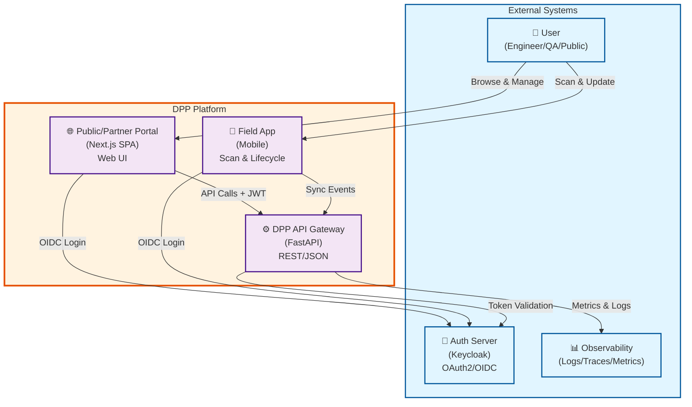
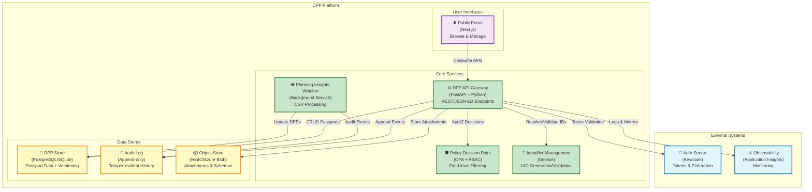
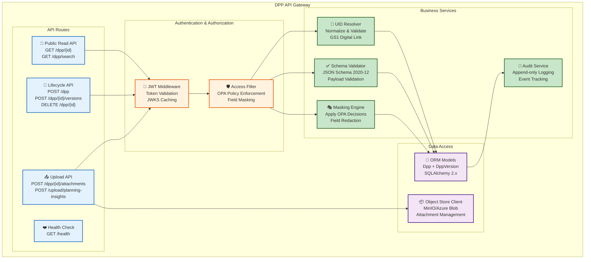
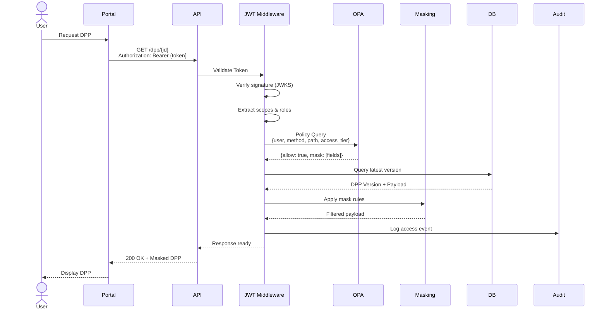
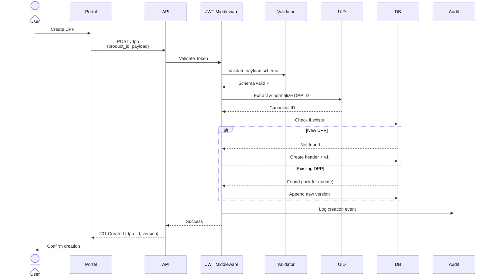
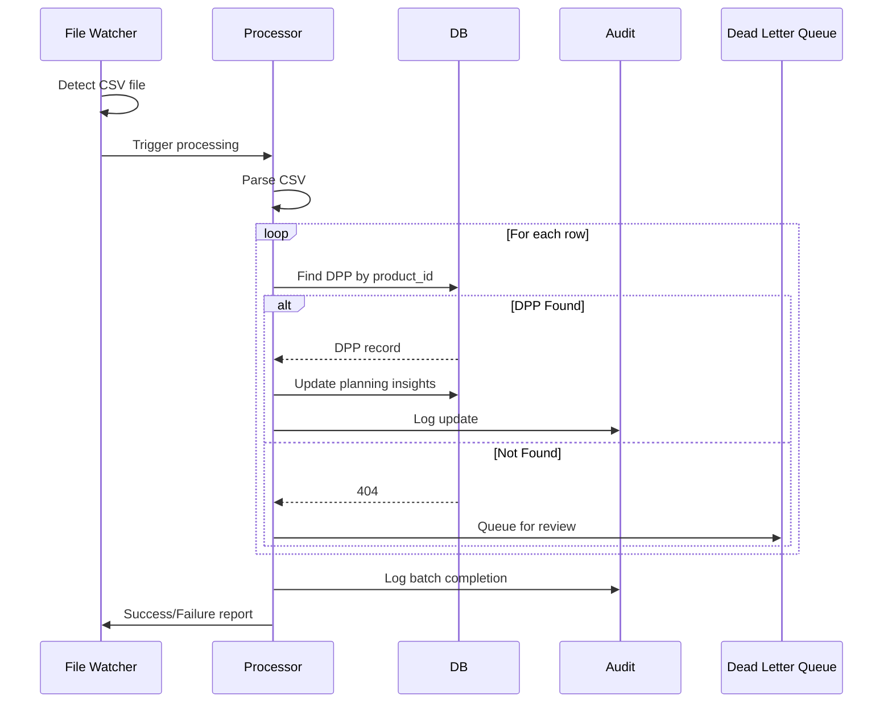

# DPP Platform Architecture

## Overview

The Digital Product Passport (DPP) Platform is a production-ready system for managing digital product passports with comprehensive authentication, authorization, and audit capabilities. The platform supports multiple deployment models (local development, Docker, Azure) and implements field-level data masking based on Open Policy Agent (OPA) policies.

## Table of Contents

- [Architecture Diagrams](#architecture-diagrams)
  - [C1: System Context](#c1-system-context)
  - [C2: Container Architecture](#c2-container-architecture)
  - [C3: API Components](#c3-api-components)
- [Current Implementation](#current-implementation)
- [Key Features](#key-features)
- [Deployment Models](#deployment-models)
- [Data Flow](#data-flow)

---

## Architecture Diagrams

### C1: System Context

### C2: Container Architecture

### C3: API Components

---

## Current Implementation

### Core Components

#### 1. **DPP API Gateway** (`api/dpp_api/`)

The primary backend service built with FastAPI:

- **Main Application** (`main.py`):
  - RESTful endpoints for DPP lifecycle management
  - Health checks and monitoring
  - Automatic schema validation
  - Comprehensive logging with file and console output
  - Background file watcher for planning insights

- **Authentication** (`auth.py`):
  - OIDC/OAuth2 integration with Keycloak
  - JWT validation with JWKS caching
  - Scope and role extraction from tokens
  - Anonymous access support for public reads
  - Demo mode for development (⚠️ disabled in production)

- **Authorization** (`auth.py`):
  - OPA integration for policy decisions
  - Field-level data masking based on policy
  - Access tier support (public/partner/internal)
  - Fail-closed security model

- **Data Models** (`models.py`):
  - `Dpp`: Header/metadata for each product passport
  - `DppVersion`: Append-only version history
  - PostgreSQL (production) or SQLite (development)
  - SQLAlchemy 2.x ORM with proper type hints

- **Services**:
  - **Identifier Management** (`services/identifiers.py`): UID normalization and Digital Link generation
  - **Object Store** (`services/object_store.py`): MinIO/Azure Blob integration for attachments
  - **Audit** (`services/audit.py`): Append-only audit logging for compliance

- **Background Workers**:
  - **Planning Insights Watcher** (`planning_insights_watcher.py`): Monitors drop folder for CSV files and updates DPP records

#### 2. **Public Portal** (`portal/`)

Next.js-based web application:

- TypeScript/React frontend
- Server-side rendering (SSR) support
- Tailwind CSS styling
- Environment-based configuration
- Production deployment via Azure App Service or Docker

#### 3. **Policy Engine** (`opa/`)

Open Policy Agent for authorization:

- Rego policy bundle (`bundle.rego`)
- Field-level masking decisions
- ABAC (Attribute-Based Access Control)
- Policy data bundles (`data.json`)

#### 4. **Identity Provider** (`keycloak/`)

Keycloak configuration:

- OAuth2/OIDC provider
- Realm imports for seeded data
- Client configurations
- Role-based access control

### Key Features

#### Authentication & Authorization

- **Multi-tier Access**: Public, Partner, Internal access levels
- **Fine-grained Control**: Field-level data masking via OPA
- **Token Management**: JWT validation with automatic JWKS refresh
- **Role Mapping**: Keycloak realm and resource roles to scopes

#### Data Management

- **Versioning**: Append-only version history for all DPPs
- **Time Travel**: Query DPP state at any point in time
- **Schema Validation**: JSON Schema 2020-12 enforcement
- **Attachments**: Object storage for files and documents

#### Audit & Compliance

- **Tamper-evident Logging**: All operations logged immutably
- **Actor Tracking**: Every action tied to authenticated user
- **Event Streaming**: Audit events for downstream systems

#### Planning Insights Integration

- **CSV File Watcher**: Automatic processing of planning data
- **Batch Updates**: Efficient bulk DPP updates
- **Error Handling**: Quarantine and retry logic
- **API Upload**: Alternative to file watcher for cloud deployments

### Deployment Models

#### 1. **Local Development** (run-local.ps1)

- SQLite database
- No authentication required
- File watcher enabled
- Fast iteration cycle
- Best for: Development and testing

#### 2. **Docker Compose** (compose.yaml)

- Full service stack
- PostgreSQL, Keycloak, OPA, MinIO
- Production-like environment
- File watcher enabled
- Best for: Integration testing

#### 3. **Azure App Service** (infra/)

- Managed PostgreSQL
- Application Insights
- HTTPS with TLS 1.2+
- Auto-scaling
- CSV upload via API endpoint (no file watcher)
- Best for: Production deployment

---

## Data Flow

### DPP Query Flow (with Masking)

### DPP Creation Flow

### Planning Insights Update Flow

---

## Related Documentation

- [API Deployment Guide](./api-deployment.md) - Azure App Service deployment details
- [Security Guide](./security.md) - Authentication and authorization configuration
- [Data Model](./data-model.md) - Database schema and versioning
- [Policy Guide](./policy.md) - OPA policy authoring and testing

---

## References

- FastAPI: [https://fastapi.tiangolo.com/](https://fastapi.tiangolo.com/)
- Open Policy Agent: [https://www.openpolicyagent.org/](https://www.openpolicyagent.org/)
- Keycloak: [https://www.keycloak.org/](https://www.keycloak.org/)
- SQLAlchemy 2.0: [https://docs.sqlalchemy.org/](https://docs.sqlalchemy.org/)
- C4 Model: [https://c4model.com/](https://c4model.com/)
