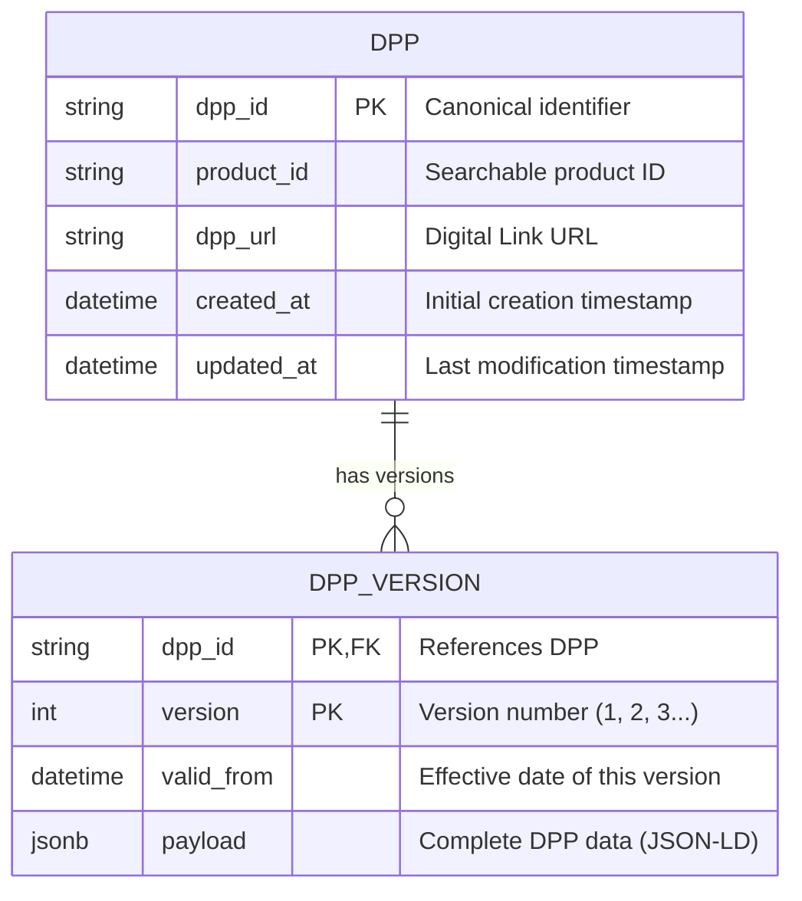
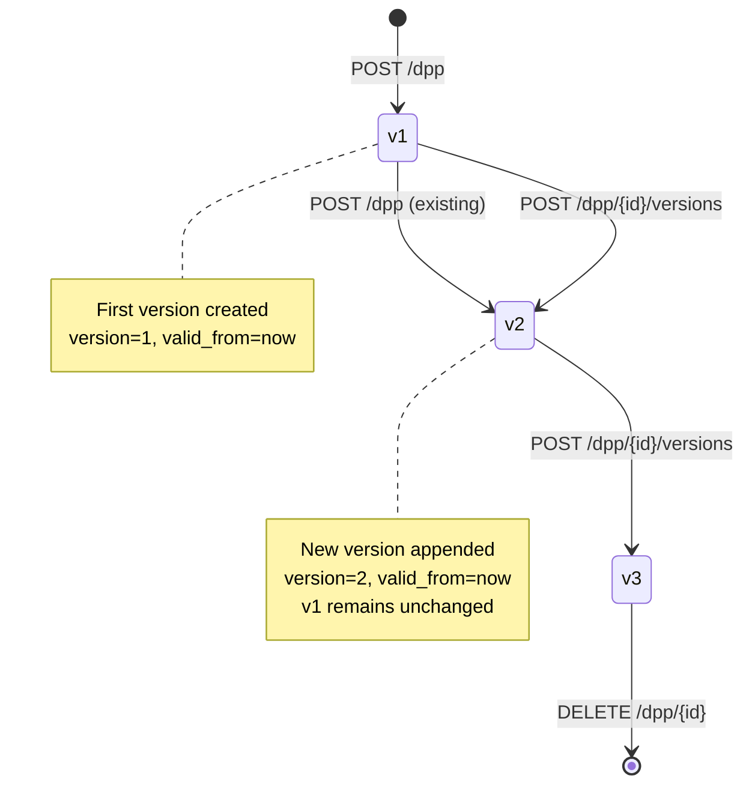

# DPP Data Model

## Overview

The DPP platform uses a versioned data model that supports:

- **Immutable History**: All changes create new versions, never overwrite
- **Time Travel**: Query data as it existed at any point in time
- **Audit Trail**: Complete change history with timestamps
- **Concurrent Updates**: Optimistic locking prevents conflicts

## Database Schema

### Entity Relationship Diagram



### Table: `dpp`

The header/metadata table for each Digital Product Passport.

| Column | Type | Constraints | Description |
|--------|------|-------------|-------------|
| `dpp_id` | VARCHAR(64) | PRIMARY KEY | Canonical DPP identifier (from payload.id) |
| `product_id` | VARCHAR(255) | INDEXED | Normalized product identifier for search |
| `dpp_url` | VARCHAR(1024) | UNIQUE, INDEXED | Public Digital Link URL |
| `created_at` | TIMESTAMP WITH TIME ZONE | NOT NULL | Initial record creation |
| `updated_at` | TIMESTAMP WITH TIME ZONE | NOT NULL | Last version update |

**Indexes:**
- PRIMARY KEY on `dpp_id`
- UNIQUE index on `dpp_url`
- B-tree index on `product_id`
- Composite index on `(product_id, created_at)` for efficient filtering

**Relationships:**
- One-to-many with `dpp_version` (cascade delete)

### Table: `dpp_version`

Append-only version history for DPP payloads.

| Column | Type | Constraints | Description |
|--------|------|-------------|-------------|
| `dpp_id` | VARCHAR(64) | PRIMARY KEY, FOREIGN KEY | References `dpp.dpp_id` |
| `version` | INTEGER | PRIMARY KEY | Sequential version number (1, 2, 3...) |
| `valid_from` | TIMESTAMP WITH TIME ZONE | NOT NULL, INDEXED | When this version became effective |
| `payload` | JSONB (PostgreSQL)<br/>JSON (SQLite) | NOT NULL | Complete DPP document (JSON-LD) |

**Indexes:**
- Composite PRIMARY KEY on `(dpp_id, version)`
- B-tree index on `valid_from` for time-travel queries
- GIN index on `payload` (PostgreSQL only) for JSON queries

**Constraints:**
- UNIQUE constraint on `(dpp_id, version)`
- Foreign key to `dpp(dpp_id)` with `ON DELETE CASCADE`

### View: `dpp_latest` (PostgreSQL only)

Convenience view for querying the latest version of each DPP.

```sql
CREATE OR REPLACE VIEW dpp_latest AS
SELECT DISTINCT ON (v.dpp_id)
    v.dpp_id,
    v.version,
    v.valid_from,
    v.payload
FROM dpp_version v
ORDER BY v.dpp_id, v.version DESC;
```

---

## Payload Structure

### JSON-LD Format

All DPP payloads follow JSON-LD (Linked Data) conventions:

```json
{
  "@context": "https://example.org/contexts/dpp.jsonld",
  "id": "urn:dpp:product:550e8400-e29b-41d4-a716-446655440000",
  "dppUrl": "https://dpp.example.com/dpp/550e8400-e29b-41d4-a716-446655440000",
  "product": {
    "model": "X-Tool 4000",
    "batch": "B-2025-Q1",
    "serialNumber": "SN-12345678"
  },
  "manufacturer": {
    "name": "Example Corp",
    "lei": "5493001KJTIIGC8Y1R12",
    "address": {
      "country": "SE"
    }
  },
  "materials": [
    {
      "type": "Steel",
      "grade": "316L",
      "percentage": 65.0
    }
  ],
  "provenance": {
    "facility": "GLN:5790001330551",
    "operator": "LEI:529900T8BM49AURSDO55"
  },
  "planningInsights": {
    "forecastedWeek": "2025-W15",
    "orderValue": 125000.50,
    "status": "confirmed"
  }
}
```

### Required Fields

- `id`: Canonical identifier (URN or URL)
- `product.model`: Product model designation

### Schema Validation

Payloads are validated against JSON Schema 2020-12:

- Schema location: `schemas/core/1-0-0.schema.json`
- Validation occurs on all `POST` and version creation operations
- Invalid payloads return `400 Bad Request` with detailed error messages

---

## Versioning Strategy

### Version Lifecycle



### Concurrency Control

The platform uses **optimistic locking** with row-level locks to prevent version conflicts:

1. **Lock on Read**: `SELECT ... FOR UPDATE` when creating versions
2. **Version Check**: Optional `Expected-Prev-Version` header validates latest version
3. **Atomic Increment**: Version number incremented atomically
4. **Conflict Detection**: Returns `409 Conflict` if version mismatch

Example with version check:

```bash
# Get current latest version (assume v5)
GET /dpp/550e8400-e29b-41d4-a716-446655440000

# Create next version with safety check
POST /dpp/550e8400-e29b-41d4-a716-446655440000/versions
Expected-Prev-Version: 5
{
  "payload": {...}
}

# Returns 409 if another client created v6 meanwhile
```

### Time-Travel Queries

Query historical state using the `at` parameter:

```bash
# Get DPP as it existed on 2025-01-15
GET /dpp/550e8400-e29b-41d4-a716-446655440000?at=2025-01-15T10:30:00Z
```

Query logic:

```sql
SELECT * FROM dpp_version
WHERE dpp_id = :id
  AND valid_from <= :timestamp
ORDER BY valid_from DESC
LIMIT 1
```

---

## Identifier Management

### DPP ID Normalization

The `services/identifiers.py` module handles:

1. **Extraction**: Extract `id` from payload
2. **Normalization**:
   - Lowercase scheme and authority
   - Remove trailing slashes
   - Validate format (URN/URL)
3. **Validation**: Ensure uniqueness and format compliance

Example transformations:

```python
"URN:DPP:Product:ABC123"     → "urn:dpp:product:abc123"
"https://Example.COM/dpp/1/" → "https://example.com/dpp/1"
"did:web:example.com:dpp:1"  → "did:web:example.com:dpp:1"
```

### Digital Link Generation

GS1 Digital Link URIs can be generated:

```python
from dpp_api.services.identifiers import generate_dl

dl_url = generate_dl(
    base="https://dpp.example.com",
    gtin="12345678901234",
    serial="ABC123"
)
# → https://dpp.example.com/01/12345678901234/21/ABC123
```

---

## Database Support

### PostgreSQL (Production)

**Recommended for:**
- Production deployments
- High concurrency
- Advanced JSON queries
- GIN indexing for fast payload searches

**Features:**
- JSONB column type for efficient storage and indexing
- `DISTINCT ON` for latest version queries
- Materialized views for performance
- Row-level security (future enhancement)

### SQLite (Development)

**Recommended for:**
- Local development
- Testing
- Quick prototypes

**Limitations:**
- JSON column type (no JSONB)
- No `DISTINCT ON` support (view not created)
- Limited concurrency
- No advanced JSON indexing

---

## Query Patterns

### Get Latest Version

```python
from dpp_api.models import get_latest_dpp_version

version = get_latest_dpp_version(db, dpp_id="urn:dpp:product:123")
payload = version.payload if version else None
```

### Get Version at Timestamp

```python
from dpp_api.models import get_dpp_as_of
import datetime as dt

timestamp = dt.datetime(2025, 1, 15, 10, 30, 0, tzinfo=dt.timezone.utc)
version = get_dpp_as_of(db, dpp_id="urn:dpp:product:123", at=timestamp)
```

### Search by Product ID

```python
from dpp_api.models import Dpp
from dpp_api.services.identifiers import normalize_id

search_term = normalize_id("ABC-123")
dpps = db.query(Dpp).filter(Dpp.product_id.ilike(f"%{search_term}%")).all()
```

### Search by Payload Field (PostgreSQL)

```sql
-- Find all DPPs with Steel material
SELECT dpp_id, version, payload
FROM dpp_version
WHERE payload @> '{"materials": [{"type": "Steel"}]}'
ORDER BY dpp_id, version DESC;
```

---

## Migration Strategy

### Adding New Fields

When adding new fields to the payload schema:

1. Update `schemas/core/1-0-0.schema.json` (or create new version)
2. Make new fields optional for backward compatibility
3. Existing versions remain unchanged (immutable)
4. New versions include new fields

Example:

```json
{
  "properties": {
    "newField": {
      "type": "string",
      "description": "New optional field"
    }
  }
}
```

### Schema Versioning

Future enhancement: Support multiple schema versions:

```
schemas/
  core/
    1-0-0.schema.json  (current)
    2-0-0.schema.json  (future)
```

Payloads can reference schema version:

```json
{
  "$schema": "https://dpp.example.com/schemas/core/2-0-0.schema.json",
  ...
}
```

---

## Audit Data Model

### Audit Log Structure

Audit events are stored in a separate append-only log (implementation pending):

```json
{
  "event_id": "uuid",
  "timestamp": "2025-01-15T10:30:00Z",
  "event_type": "dpp.create",
  "actor": "user@example.com",
  "dpp_id": "urn:dpp:product:123",
  "version": 1,
  "metadata": {
    "ip": "192.0.2.1",
    "user_agent": "..."
  }
}
```

Audit event types:
- `dpp.create`: New DPP created
- `dpp.version.create`: New version added
- `dpp.query`: DPP accessed
- `dpp.delete`: DPP deleted
- `dpp.search`: Search performed
- `planning_insights.upload`: Planning data updated

---

## Performance Considerations

### Indexing Strategy

Current indexes optimize for:

1. **Primary Key Lookups**: Fast by `dpp_id`
2. **Product Search**: B-tree index on `product_id`
3. **Time Travel**: Index on `valid_from`
4. **URL Resolution**: Unique index on `dpp_url`

### Query Optimization

- Use `joinedload()` for eager loading versions
- Avoid N+1 queries with proper relationships
- Limit result sets with pagination
- Use connection pooling (configured in `models.py`)

### Scaling Considerations

For high-volume deployments:

1. **Read Replicas**: Offload read queries to replicas
2. **Partitioning**: Partition `dpp_version` by time range
3. **Archival**: Move old versions to cold storage
4. **Caching**: Add Redis for frequently accessed DPPs

---

## Related Documentation

- [Architecture Overview](./architecture.md)
- [API Reference](./api-reference.md)
- [Security Guide](./security.md)
